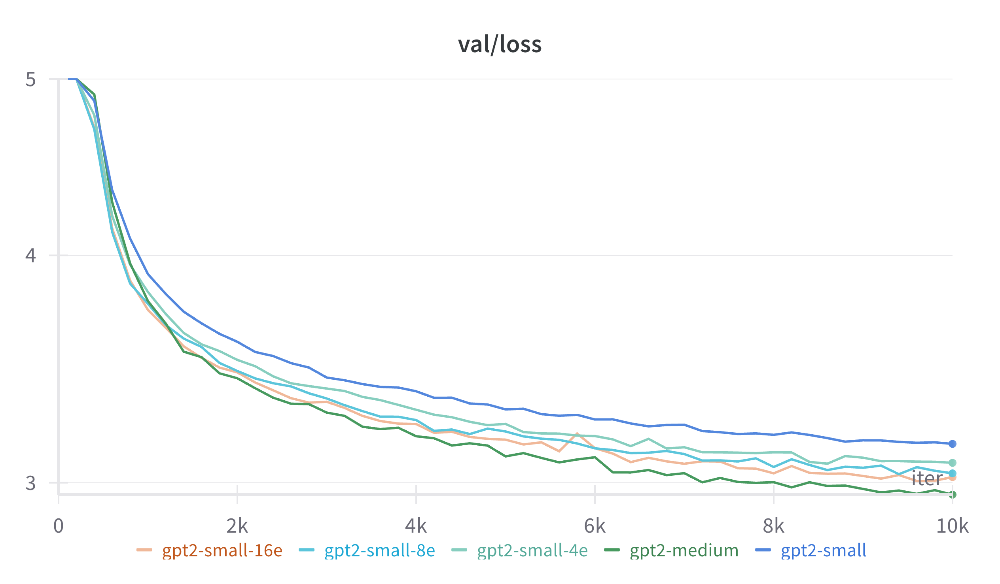

# nanoMoE

## Overview

Mixture of Experts (MoE) architecture has gained significant traction in the LLM community for good reason: these models effectively maintain the scaling laws established for dense models while keeping inference costs relatively manageable – a compelling advantage in our era of ever-growing language models.

To better understand how MoE architectures actually work under the hood, I extended Andrej Karpathy's excellent [nanoGPT](https://github.com/karpathy/nanoGPT) repository to support MoE architecture. This implementation prioritizes clarity and educational value over performance optimizations.

## Key Insights

I've documented my findings, experiments, and observations in a detailed blog post:
[nanoMoE: Extending NanoGPT with Mixture of Experts](https://sijunhe.github.io/2025/03/23/nano-moe.html)

The post covers:
- Implementation details of MoE in a minimalist framework
- Experimental results comparing MoE and dense models
- Practical insights about expert load balancing and training stability
- Visualizations of various MoE scaling patterns

## Implementation Details

The core modifications to nanoGPT include:

- **moe_model.py**: Inherits from *model.py* and implements the core MoE layers
- **train.py**: Minor modifications to accommodate MoE model architecture and track load balance loss
- **config/train_gpt2_moe*.py**: Configuration files for various MoE model variants

Everything else is forked from [nanoGPT](https://github.com/karpathy/nanoGPT) - refer to Andrej's README for details on the base implementation.

## Limitations

This implementation is designed as a learning tool to understand MoE architecture. It uses intuitive approaches (like for-loops) that aren't necessarily optimal for GPU computation. For production-scale implementations, more sophisticated techniques like Block Sparse MoE or Expert Parallelism would be required.

## Acknowledgments

This project builds directly on Andrej Karpathy's [nanoGPT](https://github.com/karpathy/nanoGPT) and draws inspiration from Google's [Switch Transformers](https://arxiv.org/abs/2101.03961) paper.
